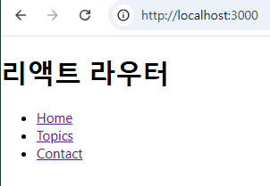
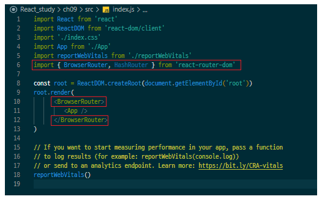
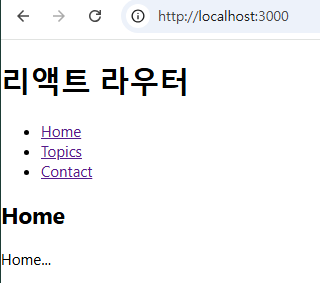

# React-router-dom
- ###  _import_ **_{Route, Routes, LavLink, Link}_** _from_  **_'react-router-dom'_**
        a태그와 Route를 이용한 Link의 차이점

- ### 1. a태그 

```
import logo from './logo.svg'
import './App.css'

function App() {
   function Home() {
      return (
         <div>
            <h2>Home</h2>
            ...Home
         </div>
      )
   }
   function Topics() {
      return (
         <div>
            <h2>Topics</h2>
            ...Topics
         </div>
      )
   }
   function Contact() {
      return (
         <div>
            <h2>Contact</h2>
            ...Contact
         </div>
      )
   }
   return (
      <div>
         <h1>리액트 라우터</h1>
         <ul>
            <li>
               <a href="/Home">Home</a>
            </li>
            <li>
               <a href="/Topics">Topics</a>
            </li>
            <li>
               <a href="/Contact">Contact</a>
            </li>
         </ul>
      </div>
   )
}
export default App
```
### 결과 


위에 Home, Topics, Contact를 함수로써 사용하지 못함

- ### 2. Router사용 (_import_ **_{Route, Routes}_** _from_  **_'react-router-dom'_** )
  -  1. index.js에 < _import { BrowserRouter, HashRouter } from 'react-router-dom'_ > 추가하기
      2. _〈 BrowserRouter 〉_ 로 _〈 App / 〉_ 감싸기

 #### 이미지


``` 
<BrowserRouter>
    <App />
</BrowserRouter>
```
### 결과


App.js에 선언한 함수들이 사용되어 아래에 출력

# Active -

## HashRouter : 주소에 /#/ 붙게됌

-  주소보다 북마크의 개념
