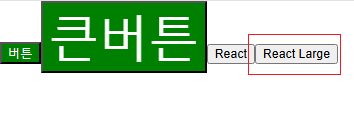
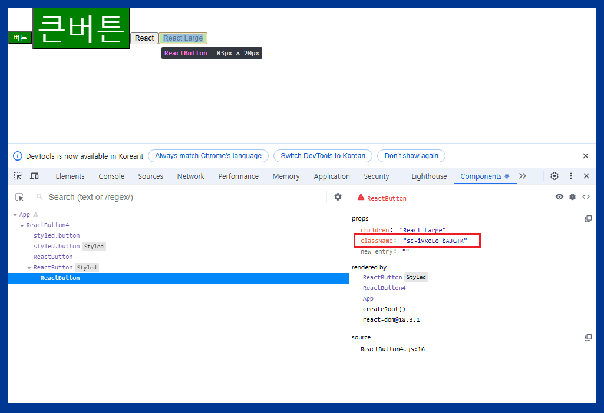
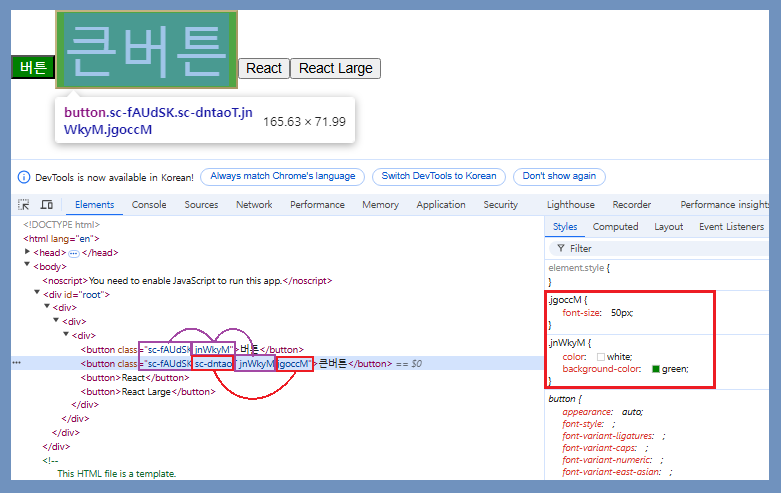
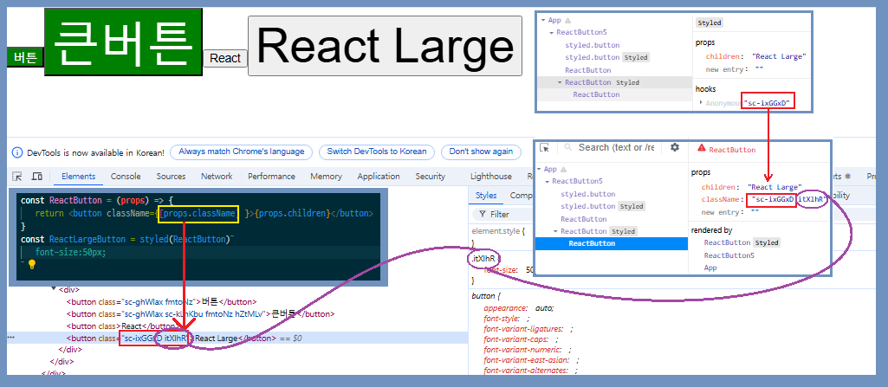

# _styled Components_ 의 작성방법과 장점

기존에는 제이슨 객체에 저장하는 방법으로 스타일명을 카멜표기법으로 사용해야했음

```
function ReactButton1 {
    const style = {
        color: 'white',
        backgroundColor: 'purple',
    }
retrun <button style={style}></button>
}
export default ReactButton1
```

## 1. 장점

1. 카멜표기법이아닌 기존의 css 표기법사용 가능
2. 이미 존재하는 Style 컴포넌트를 새로운 CSS에 적용시킬 수 있다. (wrapping 감싸기)

## 2. 설치법

적용시킬 터미널에 아래 코드 입력

- **npm install styled-components**

## 3. 사용법

styled components 라이브러리에서 사용법을 찾을 수 있다\
(기본적으로 React의 여러가지 라이브러리는 전부 해당 홈페이지에 사용법이 있음)

1. import styled from 'styled-components' 선언
2. 변수명을 대문자로 사용 (스타일이 있는 **컴포넌트**)
3. 백틱 안에 css스타일로 작성

```
const StyledButton = styled.button`
    color: white;
    background-color: green;
`
```
## Wrapping(감싸기) 


## 이미 존재하는 일반 컴포넌트 Wrapping하기
props 기능을 이용하여 감쌀 수 있음
```
// 일반적으로 했던 방식으로 리액트 전통방식 (존재하는 컴포넌트) 컴포넌트에는 똑같이 작성시 적용이 안됌

const ReactButton = (props) => {
    return <button>{props.children}</button>
}
const ReactLargeButton = styled(ReactButton)`
    font-size:50px;
`

function ReactButton4() {
    return (
        <div>
        <ReactButton>React</ReactButton>
        <ReactLargeButton>React Large</ReactLargeButton>
        </div>
    )
}
export default ReactButton4
```
\
이미지와 같이 styled가 적용이 되지 않음
### Why?
\
styled를 적용시킨 라지버튼에는 class가 자동으로 추가되기 때문


