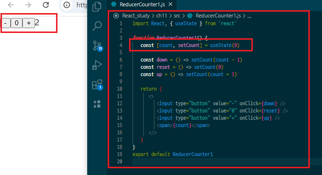
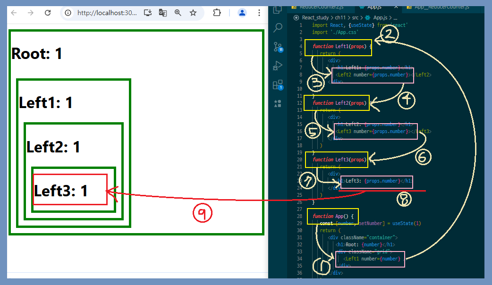

# Reducer : 관리를 하위 컴포넌트에 맡김

-  **[reducer]** : [**State**]를 직접적으로 건드려서 바꿔주는 함수
-  **[createStore]** : 리듀서를 인자로받아 [**store**]를 생성하는 함수
-  **[store]** : [**subscribe( )**], [**dispatch( )**], [**getState( )**]를 메서드로 가진 객체

> ### **_[ createStore ]_** 란?
>
> -  역할 : [**store**]를 생성하는 함수
> -  구성
>    > 받는 매개변수 : [ reducer ], [ 초기 값 preloadedState ] \
>    > 리턴 인자 : [ getState ], [ dispatch ], [ subscribe ]
>    >
>    > **In : [_preloadedState_], [_reducer_]**\
>    > **out : [_getState_], [_dispatch_], [_subscribe_]**
>    -  [**reducer**] : 상태를 업데이트 및 값 반환 역할
>    -  [**preloadedState**] : 초기값
>    -  [**getState**] : [**preloadeedState(초기값)**]을 매개변수로 받아 현재 상태를 반환
>    -  [**dispatch**] : [**reducer**]를 통한 상태 변경을 시기키 위해 action을 전달
>    -  [**subscribe(listener)**] : [**dispatch**]가 발생할 때 마다 실행

현재 상태를 반환해주는 getState, reducer를 통한 상태 변경을 시키기 위해 action을 전달하는 dispatch, 마지막으로 dispatch가 발생할 때마다 실행시키는 subscribe(listener)로 구성

\

사용자가 직접 state를 관리하는 기본방식

-  dispath에서 값을 넘겨줄때 2가지 이상이면 JSON 객체 형태로 넘겨야함

```
// 기존에 넘겨줬던 코드
   const down = () => countDispath('DOWN')
   const reset = () => countDispath('RESET')
   const up = () => countDispath("UP")
```

## Redux를 사용하는 이유

나누어진 두개의 컴포넌트에 상위 컴포넌트가 10개 20개 30개... 등등 많아지면 양쪽의 하위 컴포넌트끼리 데이터를 교환 할 때 양쪽 컴포넌트 갯수만큼 값을 올리고 내려야하는 불편함이 생긴다.

Redux는 다른 뿌리를 둔 컴포넌트에 직접적으로 데이터를 교환하기 위해 생겼다.

-  예시
   

Left3 박스까지 보내기위해 Root에서 Left1 -> Left2 -> Left3
컴포넌트를 계속 거쳐야 하는 불편함이 있음\
이는 컴포넌트가 많을수록 불편함이 증가

### _reducer(currentState, action)_

```
function reducer(currentState, action) {
    /* ▼ currentState가 정의되지 않았을 때
         ▶ state값 업데이트 */
   if (currentState === undefined) {
      return { number: 1 }
   }

    /* ▼ 값이 있다면??
         ▶ newState에 스트레드 문법으로 받아온 state를 객체형태로 저장 */
   const newState = { ...currentState }

    /* ▼ 이후action.type이 PLUS와 같다면?? (필터기능)
         ▶ newState의 넘버 증가 */
   if (action.type === 'PLUS') {
      newState.number++
   }

  return newState // ▶ 새롭게 update 된 state값을 적용

}
```

```
function App() {
   return (
      <div className="container">
         <h1>Root</h1>
         <div className="grid">
{/* ▼ Provider: stroe에 저장된 reducer, state를 제공하는 역할
  ▶ 사용법 : 제공하고 싶은 컴포넌트를 감싸기
  ▶ Left1, Right1 컴포넌트에서 store에 저장된 [reducer, state] 사용 */}
            <Provider store={store}>
               <Left1 />
               <Right1 />
            </Provider>
         </div>
      </div>
   )
}
```

```
function Left3() {
  function f(state) {
    return state.number
    }

     const number = useSelector(f)

        return (
       <div>
         <h1>Left3: {number}</h1>
       </div>
     )
}
/* state의 값을 props를 거치지 않고 무선? 연결로 가져오는 함수 */
const number = useSelector(f)
/* ▼ 개선코드 ▼ */

function Left3() {

}
```

```
function Left3() {
   //  function f(state) {
   // console.log(state)
   // return state.number
   // }

   //  const number = useSelector(f)
   //   state = {number:1}
   // useSelector에서 reducer를 실행시켜 값을 가져옴
   const number = useSelector((state) => state.number)

   return (
      <div>
         <h1>Left3: {number}</h1>
      </div>
   )
}
```

```
/* -- App.js -- */
import { createStore } from 'redux'
import { Provider, useSelector, useDispath } from 'react-redux'

function App() {
   return (
      <div className="container">
         <h1>Root</h1>
         <div className="grid">

{/* [Provider]: stroe에 저장된 reducer, state를 제공하는 역할
▼ 사용법
  ▶ 1. 제공하고 싶은 컴포넌트를 감싸기
  ▶ 2. Left1, Right1 컴포넌트에서 store에 저장된 [reducer, state] 사용 */}

            <Provider store={store}>
               <Left1 />
               <Right1 />
            </Provider>
         </div>
      </div>
   )
}
```

1. function App( )에서 **〈 Provider store={store} 〉** 를 통해 [ **const** store = createStore(reducer) ] 호출
2. [ 변수 store ]에서는 createStore를 통해 [**store**]를 생성
3. [**createStore**]는 [**reducer**]를 인자로 받아야 하므로 함수 [function **reducer( )** { }]를 선언해둠

3. reducer에서 currentState 값은 undefined이기 때문에\

   currnetState ◀ {number:1} 저장
