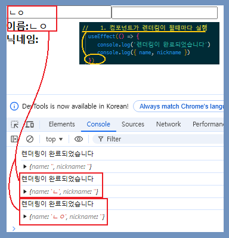
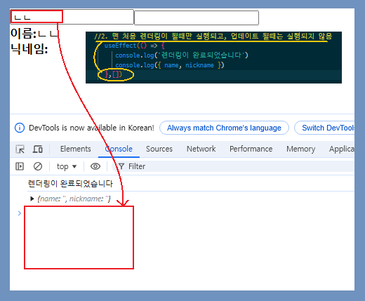
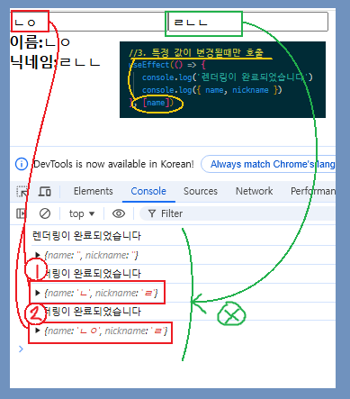
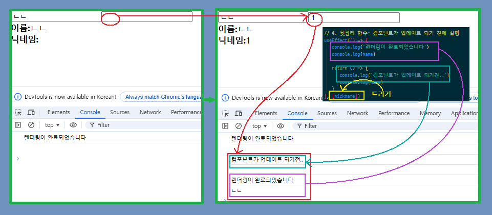

useState : 인풋창 사용때 가장 많이 쓰는것같다고함
분리를 해서 써야 useCallback 쓰기 편함
useCallback : 함수의 재생성 방지 => 최적화

-  중요 포인트
   -  리액트 : 스테이트가 바뀔때마다 재 랜던링\
       이는 컴포넌트 function안에있는 코드를 처음부터 다시 실행을 의미

그럴때마다 onChange의 (e) => setText(e.target.value)가 계속 재생성되면 쓸모없는 부하

컴포넌트 안에 있는 저런 함수같은경우
onChange = useCallback((e) => setText(e.target.value),[])

## Chapter3.jsx

```
import React, { useState } from 'react'

function Chapter3 ({name = '하서', num = 0, arr, json, func}) {
const [text, setText] = useState('')
const onChange = (e) => setText(e.target.value)

return (
    <div>
        <p>{name}{/p}
        <p>{num}{/p}
        <p>{arr.map((num) => num)}</p>
        <p>{json.react}</p>
        {/* 함수에서 return한 결과 출력 */}
        <input type='button' value={text} onChange={onChange} />


)
}

```

## Chapter4

-  이벤트 핸들링에서는 불변성 immutability이 중요함
-  스프레드 문법을 활용해여\
    데이터를 직접 변경하지 않고 변경된 데이터를 새로운 객체로 생성\
    이는 $\textsf{\bf{〈\color{navy}{state} \color{initial}{ 〉} }}$의 값이 변경되지 않아야 하기 때문

Chapter4.jsx

```
import React, { useState } from 'react'

function Chapter4 () {
    const [form, setForm] = useState({
        username: '',
        message: '',
    })

    const {username, message} = form

    const onChange = (e) => {
        const nextForm = {
            ...form, // 객체에서 username인지 message인지 구분 못함
            [e.target.name] : e.target.value, // target.name은 해당 인풋에서 name="username"을 가져오고 그 값은 value={username}으료 교체된다.
        }
        setForm(nextForm) // setForm에 nextForm을 입력해 불변성을 유지하며 state 교체
    }

    return (
        <>
            <input name="username" value={username} onChange={onChange} />
            <input name="message" value={message} onChange={onChange} />
        </>
    )
}

export default Chpater4
```

## Chapter 5

-  concat : 불변성을 유지하기 위해 (state의 불변성)\
    새 항목 추가때 사용한다.

```
import React, { useState, useCallback, useRef } from 'react'

function Chapter5 () {
    const [name, setName] = useState([
        {id:1, text: '눈사람'},
        {id:2, text: '눈'},
        {id:3, text: '겨울'},
        {id:4, text: '바람'},
    ])

    const [inputText, setInputText] = useState('')
    // const [nextId, setNextId] = useState(5)
    const nextId = useRef(5)

    const onChange = useCallback((e) => setInputText(e.target.value))

    const onClick= () => useCallback({
        const nextNames = names.concat({
            id: nextid,
            text: inputText,
        })
        setNames(nextNames)
        // setNextId(nextId +1)
        nextId.current +=1
        setInputText('')

    },[names])  // names가 작동할 때마다 가져옴 (useCallback)

    const nameList = names.map((name) => (
        <li key={name.id} onDoubleClick={() => {onRemove(name.id)}}>
            {name.text}
        </li>
    ))


/*     const onRemove = (id) => {
        const nextNames = names.filter((name) => name.id !== id) // 필터로 id구분
        setNames(nextNames)
    } */
        const onRemove = useCallback ((id) => {
            (id) => {
                const nextNames = names.filter((name) => name.id !== id)
                setNames(nextNames)
            }
    },[names])

    return (
        <>
            <input value={inputText} onChange={onChange} />
            <button onClick={onClick}></button>
            <ul>{nameList}</ul>
        <>
    )
    // namelist에 항상 key를 줘야함
}
export default Chapter5
```

## Chapter 6. Hook

-  useEffect
-  useMemo
-  useCallback
-  useRef
-  useState
-  useContext
-  useReducer
-  [커스텀훅 (ToggleExample & useToggle)](#커스텀-훅-예제)

$\small{\bf{\textsf{\color{orange}{참고 Hook 공부때 console에 2번찍히니 <React.StrictMode> 끄기}}}}$

### 핵심

-  렌더링 시점 파악
   재랜더링 되면 리소스를

-  usememo :
-  useEffect : API호출 때 굉장히 많이 사용\
   1. 사이트 입장시 렌더링 직후 무조건 1번은 실행함
   2. 렌더링

### 3가지 방법

$\bf{\textsf{\color{navy}{}}}$

-  $\bf{\textsf{\color{navy}{Props\ 변경}}}$\
    Props 변경 => 컴포넌트 업데이트 => 렌더링
-  $\bf{\textsf{\color{navy}{State\ 변경}}}$\ State 변경\
    state 변경 => 컴포넌트 업데이트 => 렌더링
-  $\bf{\textsf{\color{navy}{부모 컴포넌트 재 렌더링}}}$\
    부모 컴포넌트 렌더링 => 자식 컴포넌트 업데이트 => 자식 렌더링\

<details>
<summary>
$\bf{\textsf{\color{hotpink}useEffect}}$

</summary>

```
import React, { useState, useEffect } from 'react'

const UseEffectEX = () => {
   const [name, setName] = useState('')
   const [nickname, setNickname] = useState('')

   //1. 컴포넌트가 렌더링이 될때마다 실행
   //    useEffect(() => {
   //       console.log('렌더링이 완료되었습니다')
   //       console.log({ name, nickname })
   //    })

   //2. 뒤에 [] 를 붙이면 첫 렌더링 후 업데이트 때는 실행하지 않음
   //    useEffect(() => {
   //       console.log('렌더링이 완료되었습니다')
   //       console.log({ name, nickname })
   //    }, [])

   //3. 특정 값이 변경될 때 호출
   //    useEffect(() => {
   //       console.log('렌더링이 완료되었습니다')
   //       console.log({ name, nickname })
   //    }, [name])

   // 4. 뒷정리 함수: 컴포넌트가 업데이트 되기 전 실행
   useEffect(() => {
      console.log('렌더링이 완료되었습니다')
      console.log(name)

      return () => {
         console.log('컴포넌트가 업데이트 되기전..')
         console.log(name)
      }
   }, [])

   //name을 변경시킴
   const onChangeName = (e) => {
      setName(e.target.value)
   }

   //nickname을 변경시킴
   const onChangeNickName = (e) => {
      setNickname(e.target.value)
   }

   return (
      <div>
         <div>
            <input value={name} onChange={onChangeName} />
            <input value={nickname} onChange={onChangeNickName} />
         </div>
         <div>
            <div>
               <b>이름:</b>
               {name}
            </div>
            <div>
               <b>닉네임:</b>
               {nickname}
            </div>
         </div>
      </div>
   )
}

export default UseEffectEX
```

</details>

$\normalsize{\bf{\textsf{\color{navy}{1. 컴포넌트가 렌더링이 될 때마다(직후) 실행}}}}$\
 \  
 $\normalsize{\bf{\textsf{\color{navy}{2. 뒤에 [] 를 붙이면 첫 렌더링 후 업데이트 때는 실행하지 않음}}}}$\
 \
 $\normalsize{\bf{\textsf{\color{navy}{3. 특정 값이 변경될 때 호출}}}}$\
 \
 $\normalsize{\bf{\textsf{\color{navy}{4. 뒷정리 함수: 컴포넌트가 업데이트 되기 전 실행}}}}$\
 

### [커스텀 훅 예제](#chapter-6-hook)

<details>
<summary>
$\bf{\textsf{\color{hotpink}useToggle.js}}$

</summary>

```
import { useState } from 'react'

function useToggle(initialValue) {
   const [value, setValue] = useState(initialValue)

   const toggle = () => {
      setValue(!value)
   }

   return [value, toggle]
}

export default useToggle

```

</details>

<details>
<summary>
$\bf{\textsf{\color{hotpink}ToggleExample.js}}$

</summary>

```
import React from 'react'
import useToggle from './useToggle' // 커스텀 훅 임포트

function ToggleExample() {
   const [isToggled, toggle] = useToggle(false)

   return (
      <div>
         <button onClick={toggle}>{isToggled ? '끄기' : '켜기'}</button>
         {isToggled && <p>토글 상태가 켜져 있습니다.</p>}
      </div>
   )
}

export default ToggleExample

```

</details>

<details>
<summary>
$\bf{\textsf{\color{hotpink}App.js}}$
</summary>

```
import Chpater4 from './summarize/Chapter4'
// import Chpater6 from './summarize/Chapter6'
import ToggleExample from './summarize/Chpater6/ToggleExample'

function App() {
   return (
      // <Chpater4 />
      // <Chpater6 />
      <ToggleExample />
   )
}

export default App
```

</details>
