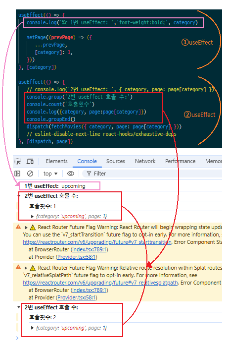

## 기초지식

-  React는 SPA(single Page Application)을 만들기 위한 프레임 워크
-

## 초기설정

-  라이브러리 설치
-  index.js ▶ [BrowserRouter] import하고 App.js 감싸기

-  폴더 구조 작성하기\
   <**_Folder_** ~ _file_>

   -  **↘ styles**
      -  common.css : pages 기본 css
      -  StyledComponents.js : pages 컴포넌트의 Wrap, Main의 설정 style css
   -  **↘ pages**
      -  Home.jsx : 기본 홈페이지
      -  Detail.jsx : 영화 상세 페이지
      -  MovieCategory.jsx : 네비바 카테고리 링크
      -  NotFound.jsx : 경로 실패 페이지
      -  SearchResutls.jsx : 영화 검색 페이지
   -  **↘ store**
      -  store.js
   -  **↘ api**

      -  tmdbApi.js : api 데이터 호출
         > $\textsf{\color{forestgreen}{export}}$ const $\textsf{\color{black}{[getMovies], [getMovieDetails], [getMovieCredits] ...}}$ **→** ${\textsf{\color{hotpink}{moviesSlice.js}}}$\
         >  ㄴ $\textsf{\color{green}{import}}$ ｛ getMovies, getMovieDetails, getMovieCredits ｝$\textsf{\color{green}{from}}$ '../../api/tmdbApi'
         >
         > $\textsf{\color{forestgreen}{export}}$ const $\textsf{\color{black}[{getTVs ...]}}$ **→** **${\textsf{\color{hotpink}{tvsSlice.js}}}$**\
         >  ㄴ $\textsf{\color{green}{import}}$｛ getTVs ｝$\textsf{\color{green}{from}}$ '../../api/tmdbApi'

   -  **↘ features** : $\textsf{\color{teal}{createSlice}}$를 이용하여 store에 보낼 $\textsf{\color{darkorange}{reducer}}$ 생성
      -  **movies** → moviesSlice.js
      -  **tvs** → tvsSlice.js
   -  **↘ components**
      -  Banner.jsx
      -  Menu.jsx
      -  Footer.jsx
      -  MovieCard.jsx
      -  **↘ css**
         -  Banner.css
         -  Menu.css
         -  Footer.css
         -  PosterSlider.css
      -  **↘ slider**
         -  PosterSlider.jsx
         -  TvSlider.jsx
         -  CreditsSlider.jsx

-

설치 라이브러리

```
npm install redux react-redux

npm install @reduxjs/toolkit

npm install @mui/material @emotion/react @emotion/styled @mui/icons-material

npm install axios

npm install react-router-dom

npm install styled-components

npm install swiper
```

package.json에 디버그 스크립트의 start 부분에 〈"set PORT=3002 &&〉를 추가하여 다른작업하면서 개발 할 수 있게함

```
  "scripts": {
    "start": "set PORT=3002 && react-scripts start",
    "build": "react-scripts build",
    "test": "react-scripts test",
    "eject": "react-scripts eject"
  },
```

> <p><span style="font-style:italic;font-weight:bold;font-size:1.1em">pages</span> Folder </p>
>
> -  Home.jsx : 메인화면
> -  Detail.jsx : 디테일
> -  MovieCategory.jsx : 영화
> -  SearchResutls.jsx : 검색 결과
> -  NotFound.jsx : 경로 찾기 실패
>
> 상위 4개 jsx파일은 모두 같은 import를 받음

### StyledComponent.js

[Home, Detail, MovieCategory, SearchResults].jsx 파일에 Main부분에 padding="30px 0"을 주게되면\
export const Main = styled.main 벡틱이 작용함

<details>
<summary>
[코드 보기]
</summary>

```
import styled from 'styled-components'

export const Wrap = styled.div`   overflow: hidden;
   min-width: ${(props) => props.$minWidth || '1200px'};`

export const Main = styled.main`   width: ${(props) => props.$width || '1200px'};
   margin: 0 auto;
   overflow: hidden;
   padding: ${(props) => props.$padding || 0};`
```

</details>

// 라우터를 이용해 화면을 보여줘야함

-  <span style="font-style:italic;font-weight:bold;font-size:1.1em">styles</span> Folder

   -  styeldComponents.js

      <details>
      <summary>
      [코드 보기]
      </summary>

      ```
      import styled from 'styled-components'

      export const Wrap = styled.div`
         overflow: hidden;
         min-width: ${(props) => props.minWidth || '1200px'};
      `

      export const Main = styled.main`
      width: ${(props) => props.width || '1200px'};
      margin: 0 auto;
      overflow: hidden;
      padding: ${(props) => props.padding || 0};
      `

      ```

</details>

```
d
```

### Banner.jsx

-  MUI : Components - 1. [TextField], 2.[Button] 사용

    <details>
    <summary>
    [핵심 코드 보기]

   **_Banner.jsx_**

    </summary>
    
    ```
    import { Button, TextField } from '@mui/material'
    import SearchIcon from '@mui/icons-material/Search'

   {/_ --- 구분선 --- _/}

   {/_ << 1. TextField >> _/}
   <TextField
   fullWidth
   label="영화검색"
   id="fullWidth"
   sx={{
          backgroundColor: 'white',
       }}
   />

   {/_ << 2. Button >> _/}
   <Button
   variant="outlined"
   startIcon={<SearchIcon />}
   sx={{
      width: 100,
      height: 56,
      backgroundColor: 'white',
      }} >

       검색

    </Button>
    ```
    </details>

<details>
<summary>
[전체 코드 보기]

**_Banner.jsx_**

</summary>

```
import '../css/Banner.css'
import { Button, TextField } from '@mui/material'
import SearchIcon from '@mui/icons-material/Search'

function Banner() {
   return (
      <div
         style={{
            width: '100%',
            height: '400px',
            backgroundImage: `linear-gradient(to bottom, rgba(0, 0, 0, 0.6), rgba(0, 0, 0, 0.2)), url(/images/banner.jpg)`,
            backgroundSize: 'cover',
            backgroundPosition: 'center',
            backgroundRepeat: 'no-repeat',
         }}
      >
         <div className="search">
            <h1 className="header_msg">환영합니다! 수백만 개의 영화를 지금 살펴보세요/</h1>

            <form className="search_form">
               <TextField
                  fullWidth
                  label="영화검색"
                  id="fullWidth"
                  sx={{
                     backgroundColor: 'white',
                  }}
               />

               <Button
                  variant="outlined"
                  startIcon={<SearchIcon />}
                  sx={{
                     width: 100,
                     height: 56,
                     backgroundColor: 'white',
                  }}
               >
                  검색
               </Button>
            </form>
         </div>
      </div>
   )
}

export default Banner

```

</details>

---

### PosterSlider.jsx

영화 슬라이더 컴포넌트로 [ **_Swiper 라이브러리_** ]를 사용하여 슬라이드 효과를 줌

-  추가할 import\
    import { Swiper, SwiperSlide } from 'swiper/react'\
    import { Navigation } from 'swiper/modules'

-  사용 라이브러리 목록

   -  Navigation

   -  Slides per view\
      : slidesPerView={n} = 보여줄 슬라이더 갯수 n개\
      : spaceBetween={x} = 슬라이더간 간격 'x'px

---

### tmdbApi.js

연습용으로 만든 **tmdb 폴더**에는 〈**_tmdpApi.js_**〉 에 [**getMovies**]만 사용하였으나 tmdb_final 폴더에서는 더 많은 함수를 작성함

endpoint : '/movie/popular' 부분에서 popular 부분을 교체시키기 위해서 작성

---

### moviesSlice.js

**!! 주의점**

1. createAsyncThunk의 async함수에서 매개변수로 여러개의 정보를 가져오기 위해서는 [객체] 또는 [배열] 형태여야함

   **_async ({ category, page })_** : 여기서 {category, page}로 객체로 묶음

   해당 코드 (1번)

   ```
   export const fetchmovies = createAsyncThunk('movies/fetchMovies', async ({ category, page }) => {
      const response = await getMovies(category, page)
      return response.data.results
   })
   ```

**!! 필요한 기능**

1. 페이지 아래에 더보기 버튼 클릭시 새로운 포스터 출력

   해당 기능은 스프레드 문법으로 [**state.movies**] 뒤에 새로운 [**_action.payload_**]를 추가함

   > ***
   >
   > 해당 코드 (2번)
   >
   > ```
   > if (action.meta.arg.page === 1) {
   >   state.movies = action.payload
   > } else {
   >
   >   // 페이지가 2 이상일 때 기존데이터 + 새로운 데이터로 state 업데이트 (더보기 버튼)
   >   state.movies = [...state.movies, ...action.payload]
   > }
   > ```
   >
   > ***

<details>
<summary>
[전체 코드 보기]

**_moviesSlice.jsx_**

</summary>

```
import { createSlice, createAsyncThunk } from '@reduxjs/toolkit'
import { getMovies } from '../../api/tmdbApi'

// <<- 1번 코드 ->>
export const fetchmovies = createAsyncThunk('movies/fetchMovies', async ({ category, page }) => {
   const response = await getMovies(category, page)
   return response.data.results
})

const moviesSlice = createSlice({
   name: 'movies',
   initialState: {
      loading: false, // 로딩 여부
      movies: [], // 영화 정보
      movieDetails: null, // 영화 상세 정보
      movieCredtis: null, // 출연 배우 정보
      error: null, // 에러 메세지
   },
   reducers: {},
   extraReducers: (builder) => {
      builder
         .addCase(fetchMovies.pending, (state) => {
            state.loading = true
         })
         .addCase(fehchMovies.fulfuilled, (state) => {
            state.loading = false
         })
         .addCase(fetchMovies.rejected, (state, action) => {
            state.loading = false

            // <<- 2번 코드 ->>

            // 페이지가 1일 때
            if (action.meta.arg.page === 1) {
               state.movies = action.payload
            } else {
               // 페이지가 2 이상일 때 기존데이터 + 새로운 데이터로 state 업데이트 (더보기 버튼)
               state.movies = [...state.movies, ...action.payload]
            }
         })
   },
})

export default moviesSlice
```

</details>

---

## $\textbf{\textsf{\color{navy}{MovieCategory.jsx}}}$

 `컬러`

```diff
- text in red
+ text in green
! text in orange
# text in gray

@@ text in purple (and bold)@@

```

-  1. Button 클릭시 onClick이 작동하여 {loadMore} 함수 작동
   2. loadMore함수에서 setPage에 스프레드 문법으로 기존 데이터를 가져온 후 , [category]:prevPage[category]+1로 해당 페이지 카테고리(ex. popular)의 페이지가 증가\
      => popular:2, now_play:1, upcoming:1
   3. category가 증가하여서 useEffect의 deps값인 [page]가 업데이트되어 다시 작동함 ... page의 state변화 감지
   4. 페이지 첫 로드와 로드시 카테고리 업데이트로 인해 2번 로딩이 문제가 있음\
      => useRef를 사용하여 문제 해결

      > useState: 값이 바뀔 때마다 리렌더링 발생\
      > useRef: 값이 바뀌더라도 리렌더링이 발생X\
      > ㄴ> Why?? useRef의 객체 참조 특징 때문,, useRef는 하나의 객체 안에서 .current를 통해 데이터 관리

   5. dispatch 의존성 배열 경고 무시하는법\
      => 주석에 // eslint-disable-next-line react-hooks/exhaustive-deps 추가하기

   ```diff
   + const isFirstLoad = useRef(true)

   ! 1. useEffect
   - // << 개전 전 코드 >>
   useEffect(() => {
      setPage((prevPage) => ({
         ...prevPage,
         [category]: 1,
      }))
   }, [category])

   + // << 개선 후 코드 >>
   useEffect(() => {
   +  if (isFirstLoad.current) {
   +     isFirstLoad.current =false
   +     return
   +  }
      setPage((prevPage) => ({
         ...prevPage,
         [category]: 1,
      }))
   },[category])

   ! 2. useEffect
   useEffect(() => {
      console.log({category, page:page[category]})
      dispatch(fetchMovies({category, page:page[category] }))
   }, [dispatch, page])

   ! useEffect는 컴포넌트 첫 렌더링시 무조건 1번은 실행함.
   !
   @@ text in yellow (and bold)@@
   @@ text in purple (and bold)@@
   ```

useEffect api 중복호출 설명 이미지

useEffect는 해당 컴포넌트 실행시 무조건 1번은 실행된다.\
이로 인해 2개의 useEffect가 실행되는데\
첫번째 useEffect의 setPage에 의해 useState의 page값이 새로 써지게된다.\
두번째 useEffect는 deps로 [page]를 주었기에 첫번째 useEffect에 의해 1번 더 작동하게되어 첫번째 이미지처럼 첫 페이지를 2번 호출하게되는 경우가 발생하게 된다.\
이를 해결하기 위해 useRef(true)를 사용하여 컴포넌트 첫 렌더링 작동시 첫번째 useEffect는 if문에 의해 return되어 아래 코드는 작동하지 않아 setPage에의한 page수정이 없게되어\
두번째 useEffect의 초기작동 1번만 작동하여 1번만 호출하게 한다.

<details>
<summary>
$\textsf{\color{darkorange}{이미지보기}}$
</summary>




</details>

```
prevPage = {
   now_playing: 1,
   upcoming: 1,
   popular: 1,
}
```

```json
+   // 색칠을 위한 코드
hi //ㅇㅇ
```

```js
// 색칠을 위한 코드
```

```js
// 색칠을 위한 코드
```

```css
// 색칠을 위한 코드
```

<span style="color:orange">example orange span</span>

<mark><u>형광<\u></mark>

~~취소선~~
<u>밑줄</u>

<span style="color:red;">your text here > </span>
